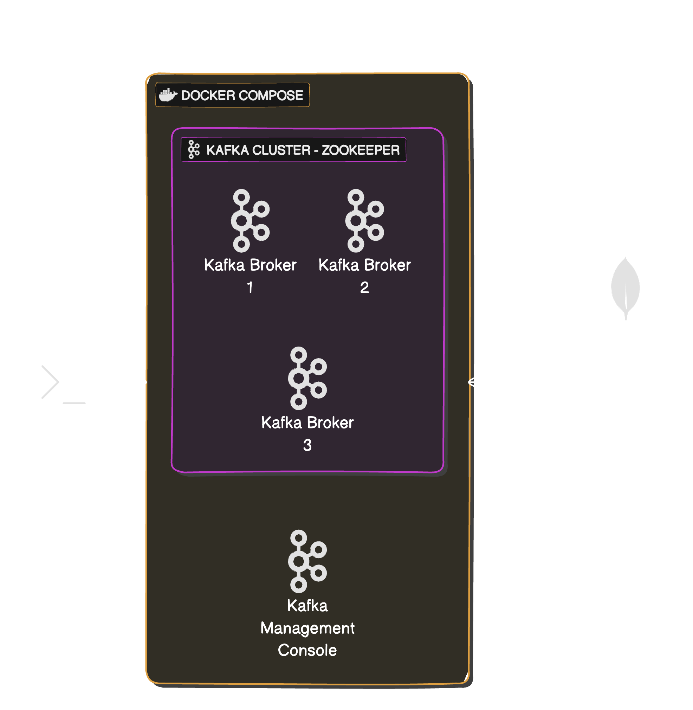

## Klaunch utility

This is a CLI tool to perform MongoDB Kafka connect reproductions.

## Pre requisites

- Docker installed.
- mlaunch installed.
- 3 node replicased running on localy.

##  Commands

- start [connector version]: Creates a Docker compose with all the necesary infrastrusture components.
By default connects to the [release repository](https://repo1.maven.org/maven2/org/mongodb/kafka/mongo-kafka-connect/) and download the latest version of MongoDB Kafka Connect.

- stop: Deletes the Docker compose components completely.

- create: Creates a connector/sink Task based on an input config file path.(json format) 

- delete: Deletes all existing Tasks and topics. Infrastructure remains.

- show [components - messages]
    - Components: List running Tasks and exisiting Topics.
    - Messages: List existing Topics and will create a consumer process to display messages on the console.

- logs: Dump a the Kafka connect log file into $repository/logs path with the following format: `$timestamps_kafka_connect.log`

### Components

- [Docker](https://www.docker.com/) is a set of products that use OS-level virtualization to deliver software in packages called containers.
- [Apache Kafka](https://kafka.apache.org/) is a framework implementation of a software bus using stream-processing
- [Cluster Manager for Apache Kafka](https://github.com/yahoo/CMAK) is a tool for managing Apache Kafka clusters.
- [Zookeeper](https://zookeeper.apache.org/) is a centralized service for maintaining configuration and naming.

### Diagram

---------------------------------

### Disclaimer

> This project uses code from other sources.