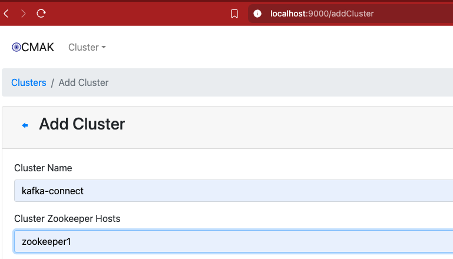

## Klaunch utility

This is a CLI tool to perform MongoDB Kafka connect reproductions.

Currently, this tool is develop and tested on macOS only.

## Pre requisites

- Docker installed.

Optional:
- mlaunch installed.
- 3 node replicaset running on localy.

### Building on Linux

This repository provides the `klaunch_linux` binary which was build on an Ubuntu 24.04 machine.

If you want to build manually on a Ubuntu/Debian-based machine, please follow these steps:

```
sudo apt install golang-go
cd klaunch
go build -o klaunch_linux
```

Steps may vary on other distributions install process like `sudo dnf install golang` or `sudo pacman -S go` but usually installing the standard Go compiler, linked and stdlib is enough.

##  Commands

- start [connector version]: Creates a Docker compose with all the necessary infrastructure components.
By default connects to the [release repository](https://repo1.maven.org/maven2/org/mongodb/kafka/mongo-kafka-connect/) and download the latest version of MongoDB Kafka Connect.

- stop: Deletes the Docker compose components completely.

- create: Creates a connector/sink Task based on an input config file path.(json format) 

- delete: Deletes all existing Tasks and topics. infrastructure remains.

- show [components - messages]
    - Components: List running Tasks and existing Topics.
    - Messages: List existing Topics and will create a consumer process to display messages on the console.

- logs: Dump a the Kafka connect log file into $repository/logs path with the following format: `$timestamps_kafka_connect.log`


### Components

- [Docker](https://www.docker.com/) is a set of products that use OS-level virtualization to deliver software in packages called containers.
- [Apache Kafka](https://kafka.apache.org/) is a framework implementation of a software bus using stream-processing
- [Cluster Manager for Apache Kafka](https://github.com/yahoo/CMAK) is a tool for managing Apache Kafka clusters.
- [Zookeeper](https://zookeeper.apache.org/) is a centralized service for maintaining configuration and naming.


### Diagram


---------------------------------

### CMAK configuration

- `http://localhost:9000/addCluster` CMAK is configured to connect to the Kafka cluster using the following properties as showed on the image below and save changes.

```
Cluster Name: kafka-connect
Cluster Zookeeper Hosts: zookeeper1
```




## Release Process

### Creating a New Release

To create a new release version of Klaunch:

1. **Update Version and Create Release Commit**
   ```bash
   # Make your changes and commit them
   git add .
   git commit -m "feat: Updates on task creation, selection and observability"
   
   # Create release commit
   git commit --allow-empty -m "Release v1.0.2 - Updates on task creation, selection and observability"
   ```

2. **Create and Push Git Tag**
   ```bash
   git tag -a v1.0.2 -m "Release v1.0.2"
   git push origin main
   git push origin v1.0.2
   ```

3. **Build Distribution Artifacts**
   ```bash
   # Checkout the release tag
   git checkout v1.0.2
   
   # Build distribution packages
   make dist
   ```
   
   **Note**: Linux builds require CGO for Kafka dependencies and cannot be cross-compiled from macOS. Build on Linux system:
   ```bash
   # On Linux system:
   make build-linux
   tar -czf dist/klaunch-v1.0.2-linux-amd64.tar.gz -C build klaunch_linux
   ```

4. **Create GitHub Release (if gh CLI available)**
   ```bash
   gh release create v1.0.2 \
     --title "Release v1.0.2" \
     --notes "Description of changes" \
     --verify-tag \
     dist/klaunch-v1.0.2-darwin-amd64.tar.gz
   ```

5. **Create Next Development Branch**
   ```bash
   git checkout main
   git checkout -b vX.Y.(Z+1)
   git push origin vX.Y.(Z+1)
   ```

### Available Make Targets for Releases

- `make release` - Build optimized release binary for current platform
- `make build-linux` - Cross-compile for Linux (may fail due to CGO dependencies)
- `make dist` - Create distribution packages for both platforms
- `make info` - Display current version and build information

### Distribution Artifacts

Release artifacts are created in the `dist/` directory:
- `klaunch-v1.0.2-darwin-amd64.tar.gz` - macOS binary
- `klaunch-v1.0.2-linux-amd64.tar.gz` - Linux binary (if built on Linux)

### Disclaimer

> This project uses code from other sources.
